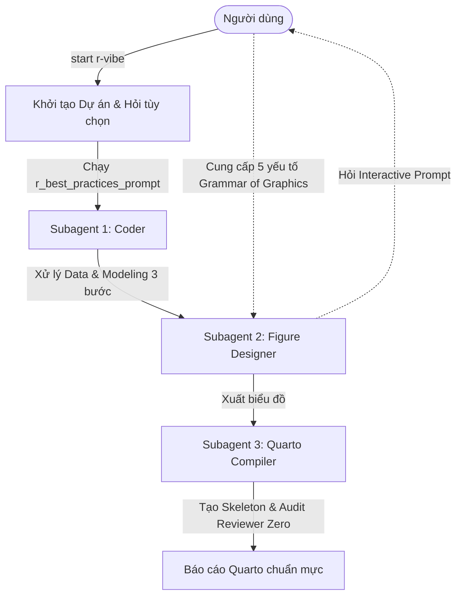

# RStudio Vibe Coding Plugin

Plugin này cung cấp môi trường làm việc chuẩn hóa "Agentic Enginere Workflow" cho ngôn ngữ R trong RStudio, được thiết kế đặc biệt để tích hợp hoàn hảo và phục vụ cho gói công cụ [ClaudeR] https://github.com/IMNMV/ClaudeR

## Tổng quan
Plugin chia quá trình phân tích số liệu lâm sàng thành một quy trình Agentic gồm 3 vai trò (Subagents) làm việc tuần tự, đảm bảo tính liêm chính khoa học (Scientific Integrity) và độ chính xác tuyệt đối qua giao thức **Reviewer Zero**.



### 3 Subagents Cốt lõi
1. **Data & Modeling Coder:** Xử lý dữ liệu (ETL) và xây dựng mô hình thống kê truyền thống (Linear, Logistic, Cox). 
   - **Interactive ETL:** Không tự động ép kiểu dữ liệu. Sẽ in danh sách biến và hỏi ý kiến User trước khi xử lý.
   - **Interactive Descriptive Statistics:** Bắt buộc liệt kê các giá trị của biến và hỏi User cách gom nhóm/mô tả trước khi lập bảng mô tả.
   - **Modeling 3 bước:** Bắt buộc tuân thủ `Fitting` -> `Tuning` -> `Evaluation`. Áp dụng các quy tắc chẩn đoán khắt khe (như VIF, Cook's distance, Proportional Hazards, Residuals plots).
2. **Figure Designer:** Chuyên viên vẽ biểu đồ `ggplot2` và `ggsci`. Hoạt động theo cơ chế **Hỏi trước khi vẽ (Grammar of Graphics)**: Luôn tương tác và thu thập 5 yếu tố cốt lõi (Aesthetics, Geometries, Facets, Themes, Labels) từ người dùng trước khi phác thảo biểu đồ.
3. **Quarto Compiler:** Phụ trách biên dịch báo cáo cuối cùng. Chỉ tạo bộ khung (skeleton) chuẩn mực và cung cấp các ghi chú định hướng viết lách (Margin Notes) thay vì sinh "văn mẫu", đảm bảo tôn trọng hoàn toàn quyền tác giả của người dùng.

## Cấu trúc Kiến thức (Dependencies)
Quá trình phân tích thừa hưởng nền tảng tư duy sâu sắc từ các kỹ năng:
- **`intro-r-vn`**: Phân tích số liệu và biểu đồ bằng tiếng Việt theo giáo trình Y khoa.
- **`mangiafico-r-biostats`**: Tiêu chuẩn Biostatistics (thống kê sinh học) chuyên sâu.
- **`tidyverse-r4ds`**: Kỹ thuật xử lý dữ liệu Tidyverse.
- **`r-clinical-rules`**: Quy tắc phân tích dữ liệu y khoa chuẩn mực của dự án.
- **`vibe-research-workflow`**: Cốt lõi tư duy liêm chính học thuật.

## Hướng dẫn Sử dụng (Quick Start)

1. Để khởi động quy trình, chỉ cần cung cấp câu lệnh:
   ```text
   start r-vibe
   ```
2. Ngay lập tức, Agent sẽ thực thi 2 nhiệm vụ khởi động:
   - **Lập kế hoạch (Bắt buộc):** Dùng công cụ `r-studio::create_task_list` để tạo danh sách TO-DO, giúp theo dõi sát sao tiến độ.
   - **Xác nhận Kiến trúc:** In ra Sơ đồ Workflow (Mermaid), xin xác nhận, và cung cấp 2 tùy chọn kiến trúc nâng cao:
     - **Tùy chọn 1:** Kích hoạt `ClaudeR::multi_agent_prompt()` (Khuyên dùng khi có nhiều file song song).
     - **Tùy chọn 2:** Kích hoạt `ClaudeR::lab_mode_prompt()` (Siêu kiểm duyệt, dùng tiến trình ngầm `async` cho dữ liệu khổng lồ / Tạp chí Q1).
     - *(Mặc định là "Không" đối với cả hai để dùng cấu trúc Role-play tối ưu tốc độ).*
3. Trong suốt quá trình thực thi:
   - **Xử lý lỗi (Self-debugging):** Nếu script R gặp lỗi, Agent sẽ dừng lại báo cáo và xin phép trước khi tìm cách sửa mã nguồn.
   - **Minh bạch số liệu:** Agent sẽ sử dụng gói `ClaudeR` và `r-studio` MCP để chạy code phân tích, tuyệt đối không "đoán" kết quả (Zero Hallucination).
4. **Kiểm duyệt cuối cùng (Reviewer Zero Protocol)**: Khi đóng gói báo cáo Quarto, `ClaudeR::reviewer_zero_prompt()` sẽ được kích hoạt để tự động kiểm tra chéo (Audit) 4 bước cho từng con số, đảm bảo những gì ghi trong văn bản khớp 100% với dữ liệu xuất ra từ phần mềm R.

---
*Plugin được thiết kế cho những bác sĩ / nhà nghiên cứu y khoa, hướng đến sự hoàn mỹ và liêm chính trong từng báo cáo thống kê.*
