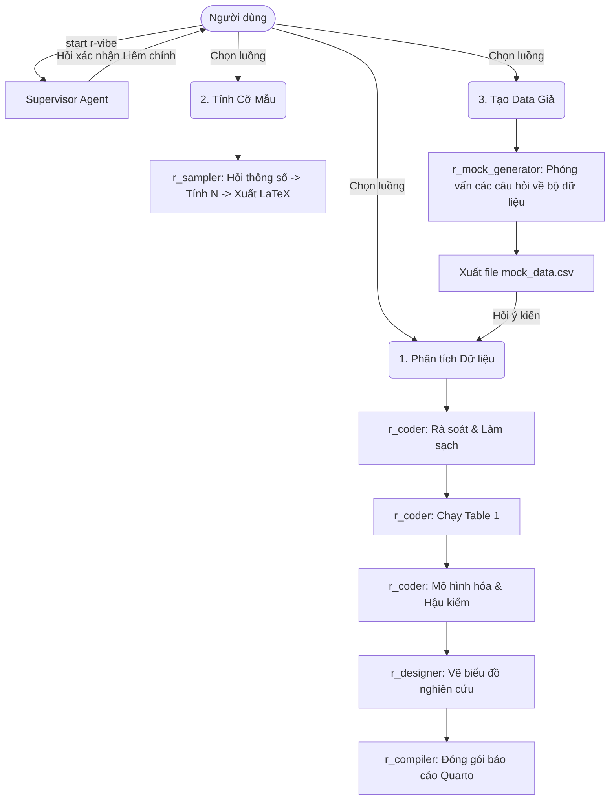

# RStudio Vibe Coding Plugin

R là một công cụ rất mạnh mẽ phục vụ cho thống kê y sinh. Tuy nhiên việc tiếp cận với lập trình là một rào cản lớn với nhân viên y tế. Dự án này là một thử nghiệm cá nhân nhằm mục đích phục vụ cho học lập trình R với Rstudio và tối ưu khả năng làm việc với sự hỗ trợ của AI. Cảm hứng của dự án dựa trên [ClaudeR](https://github.com/IMNMV/ClaudeR).

Cấu trúc dự án gồm 1 Agent giám sát chính (Supervisor) và 3 Subagents thực thi các tác vụ phân tích, giúp hạn chế tình trạng "tràn" ngữ cảnh, và AI "bịa đặt". Ngoài ra công cụ cũng đi kèm với 1 Subagent tính toán cỡ mẫu, và 1 Subagent tạo bộ dữ liệu giả định, giúp bạn có thể dùng để AI sinh code, sau đó sửa đổi và áp dụng vào dữ liệu nghiên cứu của mình hoặc phục vụ mục đích học tập. Cấu trúc code dựa vào bộ skill từ các nguồn tài liệu uy tín về R [1-3] được trích xuất bằng công cụ [book-to-skill](https://github.com/virgiliojr94/book-to-skill), các quy tắc cốt lõi khi làm việc với AI của [ClaudeR](https://github.com/IMNMV/ClaudeR) và [Supervisor-Skills](https://github.com/HKUSTDial/Supervisor-Skills).

## Hướng dẫn cài đặt

Trên Antigravity hoặc Claude Desktop, chỉ cần copy câu này dán vào khung chat:

> "Hãy cài đặt plugin này cho tôi https://github.com/nguyentranminhchien-ccpl/RStudio-Vibe-Coding-Plugin"

**Về phần kết nối MCP Server:** Plugin này yêu cầu kết nối giữa các công cụ AI với RStudio. Hướng dẫn cài đặt và sử dụng có tại [ClaudeR](https://github.com/IMNMV/ClaudeR).

## Cách hoạt động

Gõ `start r-vibe` vào chat. Sau khi đồng ý với các quy định về liêm chính khoa học khi sử dụng AI, bạn sẽ chọn 1 trong các hướng làm việc trong sơ đồ dưới.

## Subagents

1. **`r_coder` (Mã hóa & thống kê)**
   Bao gồm các bước làm việc từ trực quan hoá dữ liệu, làm sạch số liệu theo chuẩn TIDY, thống kê mô tả, thống kê suy luận. Đối với mỗi bước đều đảm bảo AI chỉ viết code và hướng dẫn. Người dùng phải đưa ra quyết định cuối cùng.

2. **`r_designer` (Vẽ biểu đồ)**
  Xây dựng biểu đồ tuân theo "grammar of graphics" dựa trên thư viện ggplot2 có sẵn trong tidyverse.

3. **`r_compiler` (Quarto)**
   Giúp người dùng biên soạn phân tích và diễn giải kết quả nghiên cứu theo cấu trúc file markdown của Quarto. Tuân thủ quy tắc: Cấm tự bịa lời bàn luận khoa học. Cấm sinh tài liệu tham khảo ảo. Mọi con số đều phải lấy trực tiếp từ R (inline code). Không điền số tĩnh (hardcode).

4. **`r_sampler` (Máy tính cỡ mẫu)**
   Hỗ trợ tính toán cỡ mẫu trong xây dựng đề cương nghiên cứu. tự động xuất đoạn mã LaTeX để copy công thức vào trình biên soạn.

5. **`r_mock_generator` (Xưởng tạo dữ liệu giả)**
   Khi bạn cần số liệu để giảng dạy hoặc test code. Nó sẽ phỏng vấn bạn 7 câu (tỉ lệ khuyết thiếu, phân phối lệch, số lượng biến...) rồi xuất ra một file `.csv` dữ liệu giả định có cấu trúc. 

## Liên hệ và Góp ý
Các góp ý và đóng góp của bạn là nguồn dữ liệu đáng quý giúp mình có thể cải tiến dự án này tốt hơn. Mọi liên hệ vui lòng qua email: nguyentranminhchien.hpmu@gmail.com. Trân trọng!

## Tài liệu tham khảo
1. S. Mangiafico. S. An R Companion for the Handbook of Biological Statistics. 1.4.3. 2026. http://rcompanion.org/documents/RCompanionBioStatistics.pdf
2. Tuan Nguyen Van. Phân Tích Số Liệu và Biểu Đồ Bằng R.
3. Lortie C. R for Data Science. J Stat Softw. 2017;77(Book Review 1). doi:10.18637/jss.v077.b01

